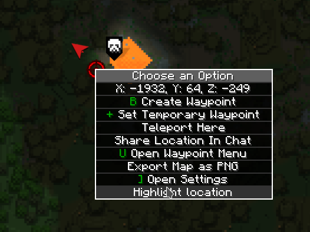
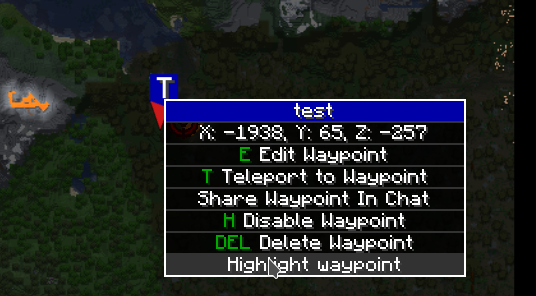
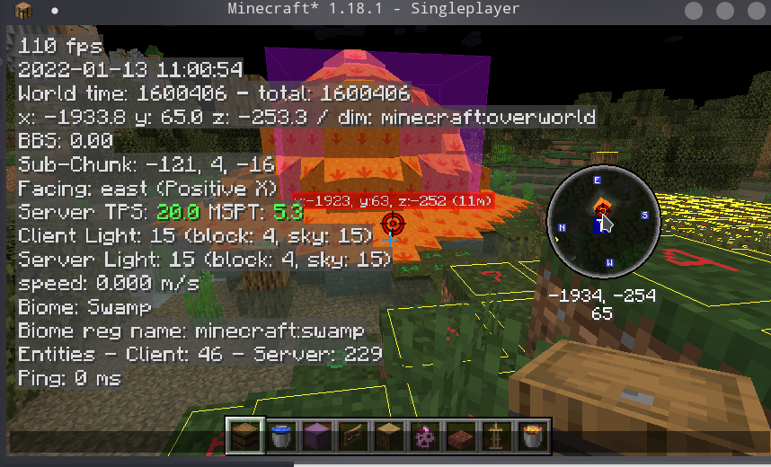

# Xaero Map Addition

## Deps

+ Oh My Minecraft Client
+ Xaero World Map
+ Xaero Mini Map
+ Magiclib https://github.com/Hendrix-Shen/MagicLib
## Features

### Chinese Translation

Add Chinese translation from https://www.bilibili.com/read/cv11613668

### Support highlight waypoint

Support highlight waypoint in world map, and can render highlight waypoint in minimap.

Highlight location:

Highlight waypoint:

Sync highlight waypoint from ommc:

